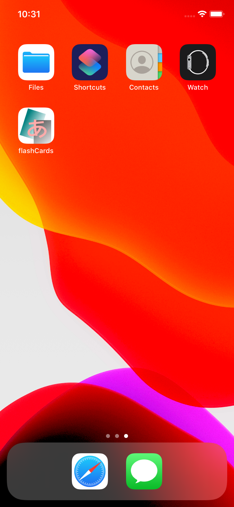
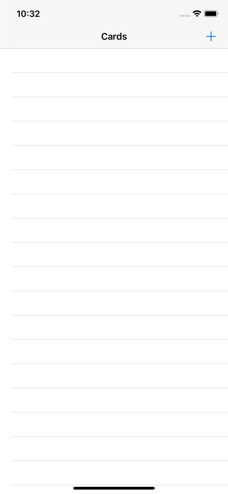
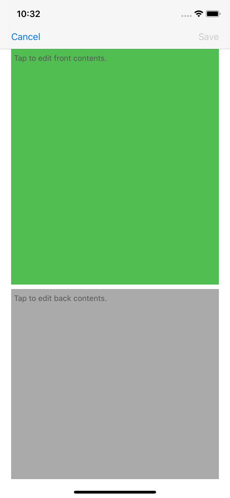
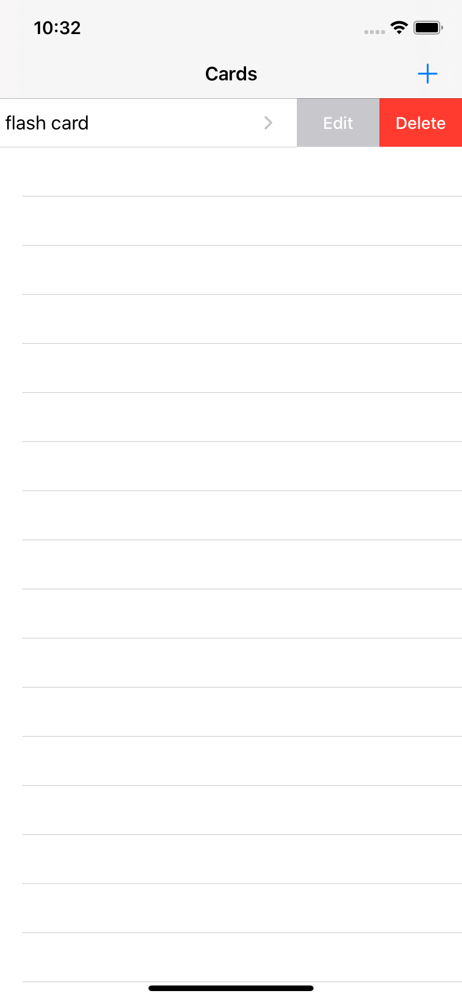
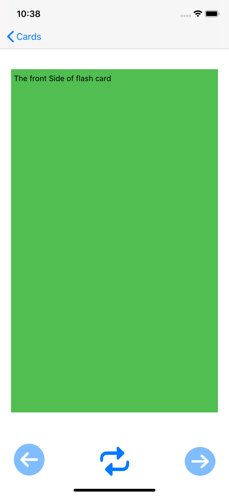
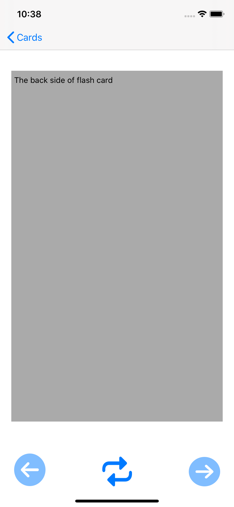

# Flash Cards
This is a mini iOS app for whom would like to learn new languages, also as a final project of [CS50](https://cs50.harvard.edu/).

# Motivation
While I'm currently learning Japanese language as my third spoken language, I really want a simple app for help. In my imagine, the app I want will be an eletronic version of flash cards.

It is essential to memorize characters, words, phrases and even common sentence at the very beginning of learning language. I might update new version for adding "categorize cards" in folders in the future.

# Screen shots

# Features

- Add: Tap the "+" button on the up-right corner to create a new card.
- Edit: To edit, swipe slight left on the list page, then tap the "Edit" button at the right of the cell.
- Delete: Same as edit, the "Delete" button is next to the edit button.
- To view: Simply tap the cell you want to review.
- To go through all cards, tapping on the right arrow button for the next card, or tap the lest arrow button for the previous one.

# Details
- `ViewController.swift` is the main view of the entire app. It shows all cards that user have created. Implement as a UItableView.
- `Card.swift` is the model of the app. It stores data in file system in the device, using sqlite3 to make queries to  `CREATE TABLE`, `SELECT`, `INSERT` and `UPDATE` the database.
- `WriteCardViewController.swift` corresponds to the **add new card feature**, write data to database so it names. The connection between `ViewController.swift` and `WriteCardViewController.swift` is `addCardSegue` which simply add by Main.storyboard. Green color indicate the **front side** of the card, and the grey color is for the **back side**.
- `CardViewController.swift` shows the front of the card selected. Users can tap the bottom button to view previous card, flip the current card or view the next one.
- `EditCardView.swift` can edit the current selected card by swiping the cell slightly left at  `ViewController.swift` then tap on edit button. 
- During implementing, I'm pleasing to know if I would like to change the back button title of the UIBarButtonItem, I have to implement in the parent view! Bescause the back destination is belong to the parent view! It's really interesting!

# Issues
Please feel free to shoot me a mail: `ac60822@gmail.com`, thanks!

# Credits
Thanks A LOT to CS50!
